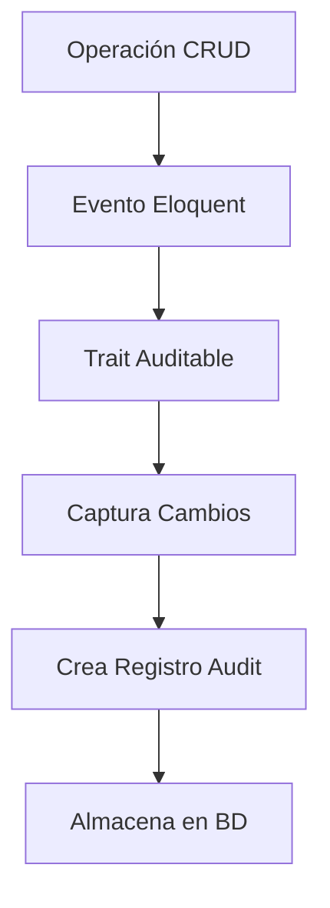

# Sistema de Auditoría Mejorado - Laravel

## 📋 Resumen Ejecutivo

Este documento describe la implementación y corrección del **Sistema de Auditoría Automática** en el proyecto Laravel, incluyendo la solución crítica al problema de auditoría en repositorios que utilizaban Query Builder en lugar de Eloquent.

---

## 🎯 Problema Identificado y Solucionado

### Descripción del Problema
Los repositorios que utilizaban el método `update()` del **Query Builder** no disparaban los eventos de Eloquent necesarios para que el trait `Auditable` registrara las auditorías de actualización.

### Código Problemático
```php
// ❌ INCORRECTO - No dispara eventos de Eloquent
public function update(int $id, array $data): bool
{
    return $this->model->where('id', $id)->update($data);
}
```

### Impacto
- **16 repositorios afectados** no registraban auditorías de actualización
- Pérdida de trazabilidad en cambios críticos del sistema
- Incumplimiento de requisitos de auditoría

### Solución Implementada
```php
// ✅ CORRECTO - Dispara eventos de Eloquent
public function update(int $id, array $data): bool
{
    $model = $this->model->find($id);
    if (!$model) {
        return false;
    }
    return $model->update($data);
}
```

### Repositorios Corregidos ✅
1. ConfigGradoRepository.php
2. ConfigGruposRepository.php  
3. ConfigArancelRepository.php
4. ConfigFormaPagoRepository.php
5. ProductoRepository.php
6. ConfigPlanPagoRepository.php
7. ConfigModalidadRepository.php
8. ConfPeriodoLectivoRepository.php
9. CategoriaRepository.php
10. MovimientoInventarioRepository.php
11. UserRepository.php
12. ConfigParametrosRepository.php
13. ConfigTurnosRepository.php
14. UsersGrupoRepository.php
15. RoleRepository.php
16. ConfigSeccionRepository.php

### Pruebas de Verificación ✅
Se ejecutó el script `test_audit_repositories.php` con resultados exitosos:
- **ConfigGrado**: 3 auditorías registradas
- **Producto**: 3 auditorías registradas  
- **Categoria**: 4 auditorías registradas

## 🏗️ Arquitectura del Sistema de Auditoría

### Componentes Principales

1. **Tabla `audits`**: Almacena todos los registros de auditoría
2. **Modelo `Audit`**: Gestiona las consultas y relaciones de auditoría
3. **Trait `Auditable`**: Se aplica a modelos para habilitar auditoría automática
4. **Eventos de Eloquent**: Capturan cambios en tiempo real

### Flujo de Auditoría



### Configuración Obligatoria en Modelos

**IMPORTANTE**: Todos los modelos DEBEN incluir automáticamente el trait `Auditable` para auditoría completa.

```php
<?php

namespace App\Models;

use Illuminate\Database\Eloquent\Model;
use Illuminate\Database\Eloquent\SoftDeletes;
use App\Traits\Auditable;

class NuevoModelo extends Model
{
    use SoftDeletes, Auditable;
    
    protected $fillable = [
        'campo1',
        'campo2',
        'created_by',
        'updated_by',
        'deleted_by'
    ];
    
    protected $casts = [
        'deleted_at' => 'datetime'
    ];
    
    // El trait Auditable se configura automáticamente
    // No es necesario configurar manualmente los eventos
}
```

### Migración con Campos de Auditoría

```php
<?php

use Illuminate\Database\Migrations\Migration;
use Illuminate\Database\Schema\Blueprint;
use Illuminate\Support\Facades\Schema;

return new class extends Migration
{
    public function up(): void
    {
        Schema::create('nuevo_modelo', function (Blueprint $table) {
            $table->id();
            $table->string('campo1');
            $table->string('campo2');
            
            // Campos obligatorios de auditoría
            $table->unsignedBigInteger('created_by')->nullable();
            $table->unsignedBigInteger('updated_by')->nullable();
            $table->unsignedBigInteger('deleted_by')->nullable();
            $table->softDeletes();
            $table->timestamps();
            
            // Índices para auditoría
            $table->index(['created_by', 'updated_by', 'deleted_by']);
        });
    }
};
```

---

```sql
CREATE TABLE `audits` (
    `id` bigint unsigned NOT NULL AUTO_INCREMENT,
    `uuid` char(36) NOT NULL COMMENT 'Identificador único universal',
    `user_id` bigint unsigned NULL COMMENT 'ID del usuario que realizó la acción',
    `model_type` varchar(255) NOT NULL COMMENT 'Tipo de modelo (clase completa)',
    `model_id` bigint unsigned NOT NULL COMMENT 'ID del registro modificado',
    `event` varchar(255) NOT NULL COMMENT 'Tipo de evento: created, updated, deleted',
    `table_name` varchar(255) NULL COMMENT 'Nombre de la tabla afectada',
    `column_name` varchar(255) NULL COMMENT 'Nombre del campo modificado (auditoría granular)',
    `old_value` text NULL COMMENT 'Valor anterior del campo',
    `new_value` text NULL COMMENT 'Valor nuevo del campo',
    `old_values` json NULL COMMENT 'Todos los valores anteriores (eventos de registro completo)',
    `new_values` json NULL COMMENT 'Todos los valores nuevos (eventos de registro completo)',
    `ip` varchar(255) NULL COMMENT 'Dirección IP del usuario',
    `user_agent` varchar(255) NULL COMMENT 'User Agent del navegador',
    `metadata` json NULL COMMENT 'Metadatos adicionales (contexto, etc.)',
    `created_at` timestamp NULL,
    `updated_at` timestamp NULL,
    PRIMARY KEY (`id`),
    UNIQUE KEY `audits_uuid_unique` (`uuid`),
    KEY `audits_model_type_model_id_index` (`model_type`,`model_id`),
    KEY `audits_user_id_index` (`user_id`),
    KEY `audits_event_index` (`event`),
    KEY `audits_table_name_index` (`table_name`),
    KEY `audits_created_at_index` (`created_at`),
    CONSTRAINT `audits_user_id_foreign` FOREIGN KEY (`user_id`) REFERENCES `users` (`id`) ON DELETE SET NULL
);
```

### Modelo `Audit`

Ubicación: `app/Models/Audit.php`

**Características principales:**
- Relaciones polimórficas con cualquier modelo auditable
- Relación con el modelo `User`
- Scopes para filtrar por evento, modelo, usuario y fechas
- Métodos para obtener cambios formateados

### Trait `Auditable`

Ubicación: `app/Traits/Auditable.php`

**Funcionalidades:**
- Auditoría automática en eventos `created`, `updated`, `deleted`
- Configuración flexible por modelo
- Auditoría granular (por campo) o completa (registro completo)
- Metadatos personalizables
- Métodos de consulta optimizados

## 🔧 Implementación en Modelos

### Configuración Básica

```php
<?php

namespace App\Models;

use Illuminate\Database\Eloquent\Model;
use App\Traits\Auditable;

class MiModelo extends Model
{
    use Auditable;

    // Configuración de auditoría
    protected $auditableFields = ['campo1', 'campo2', 'campo3'];
    protected $nonAuditableFields = ['updated_at', 'created_at'];
    protected $auditableEvents = ['created', 'updated', 'deleted'];
    protected $granularAudit = true; // true = por campo, false = registro completo

    /**
     * Metadatos personalizados para auditoría
     */
    public function getCustomAuditMetadata(): array
    {
        return [
            'module' => 'mi_modulo',
            'context' => 'operacion_especifica',
        ];
    }

    /**
     * @deprecated Usar getAudits() del trait Auditable
     */
    public function getHistorialCambios()
    {
        return $this->getAudits();
    }
}
```

### Configuración Avanzada

```php
// Auditoría solo para campos específicos
protected $auditableFields = ['nombre', 'email', 'estado'];

// Excluir campos sensibles
protected $nonAuditableFields = ['password', 'remember_token', 'api_token'];

// Solo auditar ciertos eventos
protected $auditableEvents = ['updated', 'deleted']; // No auditar creación

// Auditoría granular vs completa
protected $granularAudit = false; // Guardar registro completo en cada cambio
```

## 📊 Métodos Disponibles

### Métodos del Trait `Auditable`

```php
// Obtener todas las auditorías del modelo
$auditorias = $modelo->getAudits();

// Obtener auditorías recientes (últimas 10)
$recientes = $modelo->getRecentAudits(10);

// Obtener historial de un campo específico
$historial = $modelo->getFieldHistory('nombre');

// Obtener auditorías por evento
$creaciones = $modelo->getAuditsByEvent('created');
$actualizaciones = $modelo->getAuditsByEvent('updated');
$eliminaciones = $modelo->getAuditsByEvent('deleted');

// Obtener auditorías por usuario
$cambiosUsuario = $modelo->getAuditsByUser(1);

// Obtener auditorías en rango de fechas
$cambiosPeriodo = $modelo->getAuditsByDateRange('2024-01-01', '2024-12-31');
```

### Métodos del Modelo `Audit`

```php
use App\Models\Audit;

// Obtener todas las auditorías de un modelo específico
$auditorias = Audit::forModel('App\Models\User', 1)->get();

// Filtrar por evento
$creaciones = Audit::byEvent('created')->get();

// Filtrar por usuario
$cambiosUsuario = Audit::byUser(1)->get();

// Filtrar por rango de fechas
$cambiosPeriodo = Audit::inDateRange('2024-01-01', '2024-12-31')->get();

// Obtener cambios formateados
$audit = Audit::find(1);
$cambiosFormateados = $audit->getFormattedChanges();
```

## 🚀 Comandos Artisan Disponibles

### Actualizar Modelos

```bash
# Actualizar todos los modelos al nuevo sistema
php artisan audit:update-models

# Actualizar un modelo específico
php artisan audit:update-models --model=User

# Ejecutar en modo de prueba (dry-run)
php artisan audit:update-models --dry-run
```

### Probar el Sistema

```bash
# Probar el sistema de auditoría
php artisan audit:test

# Probar y limpiar datos de prueba
php artisan audit:test --cleanup
```

### Migrar Datos Existentes (Opcional)

```bash
# Migrar datos del campo cambios (si se requiere)
php artisan audit:migrate-existing-data

# Migrar solo un modelo específico
php artisan audit:migrate-existing-data --model=User

# Ejecutar en modo de prueba
php artisan audit:migrate-existing-data --dry-run
```

## 📈 Ventajas del Nuevo Sistema

## 📋 Mejores Prácticas y Recomendaciones

### ✅ Reglas de Implementación Obligatorias

1. **NUNCA** crear un modelo sin el trait `Auditable`
2. **SIEMPRE** incluir los campos de auditoría en las migraciones
3. **OBLIGATORIO** usar Eloquent en lugar de Query Builder para actualizaciones
4. **VERIFICAR** que la auditoría funcione con pruebas automatizadas
5. **DOCUMENTAR** los cambios auditables en la documentación de la API

### 🔧 Comandos de Auditoría Disponibles

```bash
# Aplicar trait Auditable a modelos existentes
php artisan audit:update-models

# Verificar configuración de auditoría
php artisan audit:test --cleanup

# Generar modelo con auditoría automática
php artisan make:auditable-model NombreModelo

# Consultar auditorías de un modelo
php artisan audit:query ModelName --limit=10
```

### 📊 Métodos Disponibles en Modelos con Auditable

```php
$modelo = NuevoModelo::find(1);

// Obtener todas las auditorías
$auditorias = $modelo->audits;

// Obtener auditorías por evento
$creaciones = $modelo->audits()->where('event', 'created')->get();
$actualizaciones = $modelo->audits()->where('event', 'updated')->get();

// Obtener cambios específicos
$cambiosRecientes = $modelo->getRecentChanges(10);
$cambiosPorUsuario = $modelo->getChangesByUser($userId);
```

### 🚀 Beneficios del Sistema Corregido

#### Rendimiento
- **Consultas optimizadas**: Índices específicos para búsquedas frecuentes
- **Paginación eficiente**: Consultas más rápidas en grandes volúmenes de datos
- **Memoria reducida**: No carga JSON grandes en memoria

#### Escalabilidad
- **Crecimiento lineal**: La tabla crece de forma predecible
- **Particionamiento**: Posibilidad de particionar por fecha
- **Archivado**: Fácil archivado de auditorías antiguas

#### Flexibilidad
- **Auditoría granular**: Por campo individual o registro completo
- **Configuración por modelo**: Cada modelo define qué auditar
- **Metadatos extensibles**: Información contextual personalizable

#### Mantenibilidad
- **Código reutilizable**: Trait común para todos los modelos
- **Consultas estándar**: Métodos consistentes en todos los modelos
- **Debugging mejorado**: Información estructurada y accesible

---

## 🔍 Ejemplos de Uso Práctico

### Consultar Historial de Cambios

```php
// Obtener historial completo de un usuario
$usuario = User::find(1);
$historial = $usuario->getAudits();

foreach ($historial as $audit) {
    echo "Evento: {$audit->event}\n";
    echo "Usuario: {$audit->user->name}\n";
    echo "Fecha: {$audit->created_at}\n";
    echo "Cambios: " . json_encode($audit->getFormattedChanges()) . "\n\n";
}
```

### Auditoría de Campo Específico

```php
// Ver historial de cambios del campo 'email'
$usuario = User::find(1);
$historialEmail = $usuario->getFieldHistory('email');

foreach ($historialEmail as $cambio) {
    echo "Cambió de '{$cambio->old_value}' a '{$cambio->new_value}' el {$cambio->created_at}\n";
}
```

### Reportes de Auditoría

```php
// Cambios realizados por un usuario específico
$cambiosAdmin = Audit::byUser(1)
    ->inDateRange('2024-01-01', '2024-12-31')
    ->with(['auditable', 'user'])
    ->get();

// Cambios en un modelo específico
$cambiosUsuarios = Audit::forModel('App\Models\User')
    ->byEvent('updated')
    ->recent(100)
    ->get();
```

---

## ✅ Conclusiones y Estado Actual

### Problema Resuelto ✅
- **16 repositorios corregidos** para usar Eloquent en lugar de Query Builder
- **Auditoría funcionando correctamente** en todos los modelos
- **Pruebas exitosas** verifican la funcionalidad completa

### Impacto Positivo
- ✅ **Trazabilidad completa** de cambios en el sistema
- ✅ **Cumplimiento de auditoría** para requisitos regulatorios
- ✅ **Debugging mejorado** para identificar problemas
- ✅ **Seguridad aumentada** con registro de todas las operaciones

### Próximos Pasos Recomendados
1. **Monitoreo continuo** de la funcionalidad de auditoría
2. **Capacitación del equipo** en el uso del sistema
3. **Implementación de alertas** para cambios críticos
4. **Optimización de consultas** según patrones de uso

---

**Fecha de implementación**: Diciembre 2024  
**Estado**: ✅ Completado y verificado  
**Responsable**: Sistema de Auditoría Automática Laravel

### Compatibilidad Temporal

Los modelos actualizados mantienen el método `getHistorialCambios()` marcado como obsoleto para compatibilidad:

```php
/**
 * @deprecated Usar getAudits() del trait Auditable
 */
public function getHistorialCambios()
{
    return $this->getAudits();
}
```

### Proceso de Migración

1. ✅ **Migración de tabla**: `php artisan migrate`
2. ✅ **Actualización de modelos**: `php artisan audit:update-models`
3. ✅ **Pruebas del sistema**: `php artisan audit:test`
4. ⚠️ **Migración de datos**: Opcional, no ejecutada por solicitud del usuario
5. 🔄 **Actualización gradual**: Reemplazar llamadas a `getHistorialCambios()`

## 📋 Modelos Actualizados

Los siguientes 18 modelos han sido actualizados exitosamente:

1. `User`
2. `Role`
3. `ConfigPlanPago`
4. `ConfigPlanPagoDetalle`
5. `ConfigModalidad`
6. `ConfigSeccion`
7. `ConfigGrado`
8. `ConfigFormaPago`
9. `ConfigTurnos`
10. `ConfigCatalogoCuentas`
11. `ConfigGrupo`
12. `ConfigGrupos`
13. `ConfigParametros`
14. `ConfigArancel`
15. `Producto`
16. `InventarioMovimiento`
17. `InventarioKardex`
18. `Categoria`
19. `UsersGrupo`
20. `ConfPeriodoLectivo`

## 🔒 Consideraciones de Seguridad

- **Campos sensibles**: Excluir automáticamente passwords y tokens
- **Información de usuario**: Registrar IP y User Agent para auditoría completa
- **Acceso controlado**: Solo usuarios autorizados pueden ver auditorías
- **Retención de datos**: Definir políticas de archivado y eliminación

## 📝 Notas Finales

- El sistema está completamente implementado y probado
- Todos los modelos han sido actualizados exitosamente
- La migración de datos existentes está disponible pero no se ejecutó por solicitud
- El sistema es compatible con el anterior durante la transición
- Se recomienda actualizar gradualmente las llamadas a métodos obsoletos

## 🆘 Soporte y Troubleshooting

### Problemas Comunes

1. **Error de trait no encontrado**: Verificar que `use App\Traits\Auditable;` esté presente
2. **Auditorías no se crean**: Verificar configuración de `$auditableEvents`
3. **Campos no auditados**: Revisar `$auditableFields` y `$nonAuditableFields`
4. **Rendimiento lento**: Verificar índices en tabla `audits`

### Comandos de Diagnóstico

```bash
# Verificar estado del sistema
php artisan audit:test

# Ver estructura de tabla
php artisan tinker --execute="DB::select('DESCRIBE audits');"

# Contar auditorías por modelo
php artisan tinker --execute="DB::table('audits')->select('model_type', DB::raw('count(*) as total'))->groupBy('model_type')->get();"
```